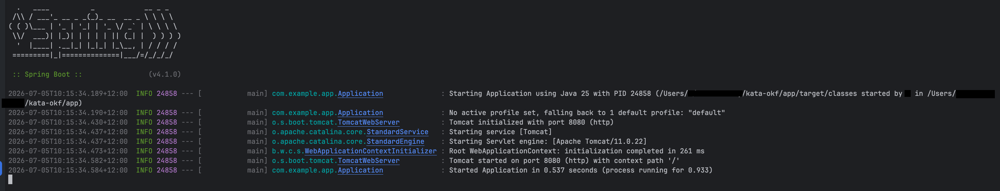
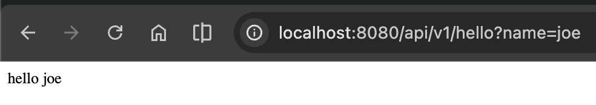

# AI Endpoint Guide for New Developers

Use this guide to ask the AI assistant for endpoint changes while keeping this repository's structure and conventions intact.

## What to edit vs. what to reference

- Edit production code in `app/`.
- Use `ai/` as guidance only (contracts and skills).
- Start with `ai/index.md`, then review:
  - `ai/agents/java-spring-agent-contract.md`
  - `ai/skills/add-spring-boot-endpoint.md`

## What to include in your prompt

Ask for one endpoint at a time and include:

- HTTP method and route (for example, `GET /api/v1/customers`)
- input shape (query params, path params, or JSON body)
- response shape (fields and types)
- behavior rules (validation, status codes, and auth assumptions)
- where to place code (usually `com.example.app.controller`)

Example prompt:

```text
Add a GET endpoint at /api/v1/customers.
Accept query param `name`.
Return JSON with fields `name` and `message`.
Use ResponseEntity and Spring Boot conventions in this repo.
Follow ai/skills/add-spring-boot-endpoint.md.
After changes, run compile from /app.
```





## Validation expectations

For Java code changes, ask the AI to run checks from `app/` and report output.

```bash
cd /Users/l/eroad-study/kata-okf/app
mvn clean compile
```

If tests are available in your environment, also run:

```bash
cd /Users/l/eroad-study/kata-okf/app
mvn test
```

## Review checklist before merging

- Endpoint is under `app/src/main/java/...` in the correct package.
- Route path and method match your request.
- Response contract matches your API expectation.
- Build/test results are reported.
- No unrelated files were changed.

